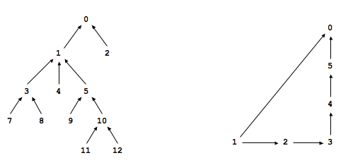

## Programming Assignment 1: WordNet 

### Jump to the explanation of my [implementation](#solution)
[WordNet][0] is a semantic lexicon for the
English language that is used extensively by computational linguists
and cognitive scientists; for example, it was a key component in IBM's
[Watson][1].
WordNet groups words into sets of synonyms called _synsets_ and 
describes semantic relationships between them.
One such relationship is the _is-a_ relationship, which connects a _hyponym_
(more specific synset) to a _hypernym_ (more general synset).
For example, _locomotion_ is a hypernym of _running_
and _running_ is a hypernym of _dash_.

**The WordNet digraph.**
Your first task is to build the wordnet digraph: each vertex _v_
is an integer that represents a synset, and each directed edge _v→w_
represents that _w_ is a hypernym of _v_.
The wordnet digraph is a _rooted DAG_: it is acyclic and has one vertex---the root---that
is an ancestor of every other vertex.
However, it is not necessarily a tree because a synset can have more than one
hypernym. A small subgraph of the wordnet digraph is illustrated below.

**The WordNet input file formats.**
We now describe the two data files that you will use to create the wordnet digraph.
The files are in _CSV format_: each line contains a sequence of fields,
separated by commas.

* _List of noun synsets._
The file [synsets.txt][2]
lists all the (noun) synsets in WordNet.
The first field is the _synset id_ (an integer),
the second field is the synonym set (or _synset_), and the
third field is its dictionary definition (or _gloss_).
For example, the line

>     36,AND_circuit AND_gate,a circuit in a computer that fires only when all of its inputs fire  
>     
> 
> 

means that the synset { AND\_circuit, AND\_gate }
has an id number of 36 and it's gloss is
a circuit in a computer that fires only when all of its inputs fire.
The individual nouns that comprise a synset are separated
by spaces (and a synset element is not permitted to contain a space).
The _S_ synset ids are numbered 0 through _S_ − 1;
the id numbers will appear consecutively in the synset file.

* _List of hypernyms._
The file [hypernyms.txt][3]
contains the hypernym relationships:
The first field is a synset id; subsequent fields are the id numbers
of the synset's hypernyms. For example, the following line

>     164,21012,56099
>     
> 
> 

means that the the synset 164 ("Actifed") has two hypernyms:
21012 ("antihistamine") and
56099 ("nasal\_decongestant"),
representing that Actifed is both an antihistamine and a nasal decongestant.
The synsets are obtained from the corresponding lines in the file synsets.txt.

>     164,Actifed,trade name for a drug containing an antihistamine and a decongestant...
>     21012,antihistamine,a medicine used to treat allergies...
>     56099,nasal_decongestant,a decongestant that provides temporary relief of nasal...
>     
> 
> 

**WordNet data type.**
Implement an immutable data type WordNet with the following API:

>     // constructor takes the name of the two input files
>     public WordNet(String synsets, String hypernyms)
>     
>     // the set of nouns (no duplicates), returned as an Iterable
>     public Iterable<String> nouns()
>     
>     // is the word a WordNet noun?
>     public boolean isNoun(String word)
>     
>     // distance between nounA and nounB (defined below)
>     public int distance(String nounA, String nounB)
>     
>     // a synset (second field of synsets.txt) that is the common ancestor of nounA and nounB
>     // in a shortest ancestral path (defined below)
>     public String sap(String nounA, String nounB)
>     
>     // for unit testing of this class
>     public static void main(String[] args)
>     
> 
> 

The constructor should throw a java.lang.IllegalArgumentException
if the input does not correspond to a rooted DAG.
The distance() and sap() methods
should throw a java.lang.IllegalArgumentException
unless both of the noun arguments are WordNet nouns.

Your data type should use space linear in the input size
(size of synsets and hypernyms files).
The constructor should take time linearithmic (or better) in the input size.
The method isNoun() should run in time logarithmic (or better) in
the number of nouns.
The methods distance() and sap() should run in time linear in the
size of the WordNet digraph.

**Shortest ancestral path.**
An _ancestral path_ between two vertices
_v_ and _w_ in a digraph is a directed path from
_v_ to a common ancestor _x_, together with
a directed path from _w_ to the same ancestor _x_. 
A _shortest ancestral path_ is an ancestral path of minimum total length.
For example, in the digraph at left
([digraph1.txt][4]),
the shortest ancestral path between
3 and 11 has length 4 (with common ancestor 1).
In the digraph at right ([digraph2.txt][5]),
one ancestral path between 1 and 5 has length 4
(with common ancestor 5), but the shortest ancestral path has length 2
(with common ancestor 0).

  
**SAP data type.**
Implement an immutable data type SAP with the following API:

>     // constructor takes a digraph (not necessarily a DAG)
>     public SAP(Digraph G)
>     
>     // length of shortest ancestral path between v and w; -1 if no such path
>     public int length(int v, int w)
>     
>     // a common ancestor of v and w that participates in a shortest ancestral path; -1 if no such path
>     public int ancestor(int v, int w)
>     
>     // length of shortest ancestral path between any vertex in v and any vertex in w; -1 if no such path
>     public int length(Iterable<Integer> v, Iterable<Integer> w)
>     
>     // a common ancestor that participates in shortest ancestral path; -1 if no such path
>     public int ancestor(Iterable<Integer> v, Iterable<Integer> w)
>     
>     // for unit testing of this class (such as the one below)
>     public static void main(String[] args)
>     
> 
> 

All methods should throw a java.lang.IndexOutOfBoundsException if 
one (or more) of the input arguments is not between 0 and G.V() - 1.
You may assume that the iterable arguments contain at least one integer.
All methods (and the constructor) should take time at most
proportional to _E_ + _V_
in the worst case, where _E_ and _V_ are the number of edges and vertices
in the digraph, respectively.
Your data type should use space proportional to _E_ + _V_.

**Test client.**
The following test client takes the name of a digraph input file as
as a command-line argument, constructs the digraph,
reads in vertex pairs from standard input,
and prints out the length of the shortest ancestral path between the two vertices
and a common ancestor that participates in that path:

>     public static void main(String[] args) {
>         In in = new In(args[0]);
>         Digraph G = new Digraph(in);
>         SAP sap = new SAP(G);
>         while (!StdIn.isEmpty()) {
>             int v = StdIn.readInt();
>             int w = StdIn.readInt();
>             int length   = sap.length(v, w);
>             int ancestor = sap.ancestor(v, w);
>             StdOut.printf("length = %d, ancestor = %d\n", length, ancestor);
>         }
>     }
>     
> 
> 

Here is a sample execution:

>     % **more digraph1.txt**             % **java SAP digraph1.txt**
>     13                              **3 11**
>     11                              length = 4, ancestor = 1
>      7  3                            
>      8  3                           **9 12**
>      3  1                           length = 3, ancestor = 5
>      4  1
>      5  1                           **7 2**
>      9  5                           length = 4, ancestor = 0
>     10  5
>     11 10                           **1 6**
>     12 10                           length = -1, ancestor = -1
>      1  0
>      2  0
>     
> 
> 

**Measuring the semantic relatedness of two nouns**.
Semantic relatedness refers to the degree to which two concepts are related. Measuring 
semantic relatedness is a challenging problem. For example, most of us agree that 
_George Bush_ and _John Kennedy_ (two U.S. presidents)
are more related than are _George Bush_
and _chimpanzee_ (two primates). However, not most of us agree that _George Bush_
and _Eric Arthur Blair_ are related concepts. But if one is aware that _George 
Bush_ and _Eric Arthur Blair_ (aka George Orwell) are both communicators, then it becomes clear 
that the two concepts might be related.

We define the semantic relatedness
of two wordnet nouns _A_ and _B_ as follows:

* _distance(A, B)_ = 
distance is the minimum length of any ancestral path between
any synset _v_ of _A_ and any synset _w_ of _B_.

This is the notion of distance that you will use to implement the
distance() and sap() methods in the WordNet data type.

**Outcast detection.**
Given a list of wordnet nouns _A_1, _A_2,
..., _A__n_, which noun
is the least related to the others? To identify _an outcast_,
compute the sum of the distances between each noun and every other one:

> _d__i_ =  
> dist(_A__i_, _A_1)   +  
> dist(_A__i_, _A_2)   +   ...   +   
> dist(_A__i_, _A__n_)
> 

and return a noun _A__t_
for which _d__t_ is maximum.

Implement an immutable data type Outcast with the following API:

>     // constructor takes a WordNet object
>     public Outcast(WordNet wordnet)
>     
>     // given an array of WordNet nouns, return an outcast
>     public String outcast(String[] nouns)
>     
>     // for unit testing of this class (such as the one below)
>     public static void main(String[] args)
>     
> 
> 

Assume that argument array to the outcast() method
contains only valid wordnet nouns (and that it contains at least two such nouns).

The following test client takes from the command line the 
name of a synset file, the name of a hypernym file, followed by the
names of outcast files, and prints out an outcast in each file:

>     public static void main(String[] args) {
>         WordNet wordnet = new WordNet(args[0], args[1]);
>         Outcast outcast = new Outcast(wordnet);
>         for (int t = 2; t < args.length; t++) {
>             In in = new In(args[t]);
>             String[] nouns = in.readAllStrings();
>             StdOut.println(args[t] + ": " + outcast.outcast(nouns));
>         }
>     }
>     
> 
> 

Here is a sample execution:

>     % **more outcast5.txt**
>     horse zebra cat bear table
>     
>     % **more outcast8.txt**
>     water soda bed orange_juice milk apple_juice tea coffee
>     
>     % **more outcast11.txt**
>     apple pear peach banana lime lemon blueberry strawberry mango watermelon potato
>     
>     
>     % **java Outcast synsets.txt hypernyms.txt outcast5.txt outcast8.txt outcast11.txt**
>     outcast5.txt: table
>     outcast8.txt: bed
>     outcast11.txt: potato
>     
> 
> 

**Analysis of running time (optional).**
Analyze the effectiveness of your approach to this problem by giving estimates of 
its time requirements. 

* Give the order of growth of the _worst-case_
running time of the length() and ancestor() methods
in SAP as a function of the number of
vertices _V_ and the number of edges _E_ in the digraph.

* Give the order of growth of the _best-case_ running time of
the same methods.

**Deliverables.**
Submit WordNet.java, SAP.java, and Outcast.java
that implement the APIs described above.
Also submit any other supporting
files (excluding those in stdlib.jar and algs4.jar).
Your may not call any library functions other than those in
java.lang, java.util, stdlib.jar, and algs4.jar.

  
---

_This assignment was created by Alina Ene and Kevin Wayne._

Copyright (c) 2006

## Solution

[0]: http://wordnet.princeton.edu/
[1]: http://en.wikipedia.org/wiki/Watson_(computer)
[2]: http://coursera.cs.princeton.edu/algs4/testing/wordnet/synsets.txt
[3]: http://coursera.cs.princeton.edu/algs4/testing/wordnet/hypernyms.txt
[4]: http://coursera.cs.princeton.edu/algs4/testing/wordnet/digraph1.txt
[5]: http://coursera.cs.princeton.edu/algs4/testing/wordnet/digraph2.txt
